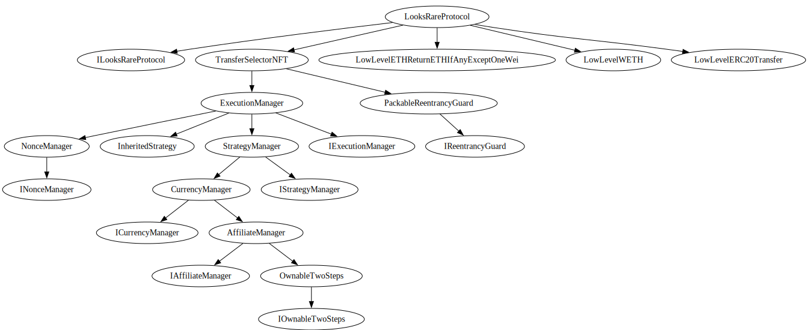

# @looksrare/contracts-exchange-v2

[](https://github.com/LooksRare/contracts-exchange-v2/actions/workflows/tests.yaml)
[](https://opensource.org/licenses/MIT)
[](https://github.com/LooksRare/sdk-v2)

## Description

This project contains core smart contracts used for the LooksRare exchange protocol ("v2").

It also contains a peripheral contract (`OrderValidatorV2A`) that is used to verify the validity of (maker) orders.

## Installation

```shell
# Yarn
yarn add @looksrare/contracts-exchange-v2

# NPM
npm install @looksrare/contracts-exchange-v2
```

## NPM package

The NPM package contains the following:

- Solidity smart contracts (_".sol"_)
- ABIs (_".json"_)

ABIs are also distributed in the `@looksrare/sdk-v2` package.

## Documentation

The documentation for the exchange smart contracts will be available [here](https://docs.looksrare.org/developers/welcome).

## Architecture



## Setup

- Run `yarn`
- Install [Forge](https://book.getfoundry.sh/getting-started/installation.html)
- Run `forge update`
- Run `git submodule update`

## About this repo

### Structure

It is a hybrid [Hardhat](https://hardhat.org/) repo that also requires [Foundry](https://book.getfoundry.sh/index.html) to run Solidity tests powered by the [ds-test library](https://github.com/dapphub/ds-test/).

> To install Foundry, please follow the instructions [here](https://book.getfoundry.sh/getting-started/installation.html).

### Run tests

- Solidity tests are included in the `foundry` folder in the `test` folder at the root of the repo.

### Example of Foundry/Forge commands

```shell
forge build
forge test
forge test -vv
forge tree
```

### Example of shell commands

```shell
npx eslint '**/*.{js,ts}'
npx eslint '**/*.{js,ts}' --fix
npx prettier '**/*.{json,sol,md}' --check
npx prettier '**/*.{json,sol,md}' --write
npx solhint 'contracts/**/*.sol'
npx solhint 'contracts/**/*.sol' --fix
```

### Coverage

It is required to install lcov.

```shell
brew install lcov
```

To run the coverage report, the below command can be executed.

```
forge coverage --report lcov
LCOV_EXCLUDE=("test/*" "contracts/libraries/*" "contracts/helpers/ProtocolHelpers.sol")
echo $LCOV_EXCLUDE | xargs lcov --output-file lcov-filtered.info --remove lcov.info
genhtml lcov-filtered.info --output-directory out
open out/index.html
```
